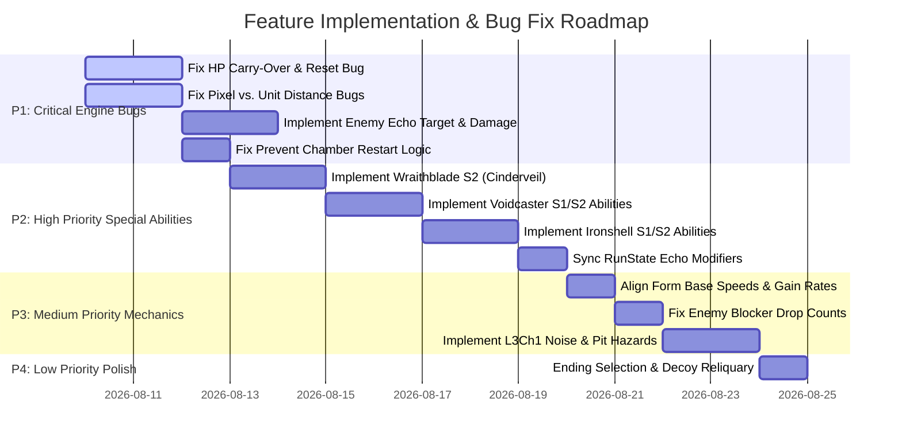

# Echoes of the Ashen Vault — Feature Alignment & Gap Analysis

**Document Purpose:** This document provides a complete audit comparing every single feature, mechanic, stat, formula, and chamber requirement defined in [`game-description.md`](file:///d:/Code/CS202%20Lab/cs202-dungeon-game/documents/game-description.md) against the current C++ codebase implementations. 

All identified gaps, bugs, missing mechanics, and misalignments are categorized and sorted by **Priority (High to Low)**.

---

## Priority Overview & Action Matrix

| Priority Level | Category | Key Focus Areas | Count |
| :--- | :--- | :--- | :--- |
| **P1 — CRITICAL (Highest)** | Core Game Engine & Game Loop | Continuous HP reset bug, Uninvoked Echo damage mechanics, Prevent chamber restart bug, Pixel vs. Unit radius scaling bugs in enemy AI/AOE. | 6 |
| **P2 — HIGH** | Form Special Abilities & Modifiers | Placeholder `// TODO` Special Abilities for Wraithblade, Voidcaster & Ironshell; RunState Echo modifier synchronization. | 7 |
| **P3 — MEDIUM** | Enemies, Combat Mechanics & Stats | Form base speed misalignments, enemy blocker drop counts, missing form bonuses, enemy pathing to Echoes, L3Ch1 noise mechanic. | 8 |
| **P4 — LOW** | Secondary Features & Polish | Decoy reliquary buff, visual opacity telegraphs, minor text & ending selection logic. | 4 |
| **EXPANSION** | User-Requested Features | Difficulty modes, Inter-chamber run statistics screen, On-screen chamber timer, Minimap radar, Multiplayer / Co-op support. | 5 |

---

## 1. Detailed Feature Audit Matrix

Below is the complete feature-by-feature verification checklist matching every section of [`game-description.md`](file:///d:/Code/CS202%20Lab/cs202-dungeon-game/documents/game-description.md).

### §1 & §6: Core Loop, HP Persistence & Campaign Structure

| Spec Feature / Rule | Expected Behavior | Codebase Status | Alignment | Priority |
| :--- | :--- | :--- | :--- | :--- |
| **1.1 Campaign Chamber Flow** | L1 (3 main + Mid) → L2 (3 main + Mid) → L3 (4 main + Mid) → Boss. Mid-Chambers occur *between* main chambers. | `campaign.json` places `mid.json` at the *end* of each level rather than between main chambers. | ⚠️ **Misaligned** | **P2 — High** |
| **1.2 Continuous HP Pool** | HP does **not** reset between chambers or levels. Shared HP carries into next chamber and into Boss fight. | `GameplayState` instantiates a new `Player` object with 100 HP every time a chamber loads, completely resetting HP. | 🔴 **Critical Bug** | **P1 — Critical** |
| **1.3 Gauntlet HP Heal** | +25% Max HP heal granted on clearing each Gauntlet (L1Ch3, L2Ch3, L3Ch3). | `GauntletChamber` calculates the heal, but HP reset on chamber transition immediately overwrites it. | ⚠️ **Broken by HP Bug** | **P1 — Critical** |
| **1.4 Run Ending Determination** | Ending A (0 stolen), Ending B (1–2 stolen), Ending C (3–5 stolen). | `game-play-state.cpp` hardcodes `EndingType::ENDING_A_SHATTER` upon boss victory, ignoring `echoesStolen`. | ⚠️ **Misaligned** | **P2 — High** |

---

### §2: Player Forms & Base Stats

| Spec Feature / Rule | Expected Behavior | Codebase Status | Alignment | Priority |
| :--- | :--- | :--- | :--- | :--- |
| **2.1 Unified HP Pool & Switching** | 100 Max HP shared; flat HP preserved on form switch. | `Player` class holds unified HP pool and preserves flat HP when swapping forms. | ✅ **Aligned** | — |
| **2.2 Wraithblade Base Stats** | Speed 7.0 units/s, Dmg 12, Def 15, Range 1.5, Rate 2/s. | Speed set to **9.0** in `wraithblade-form.cpp` instead of **7.0**. | ⚠️ **Misaligned** | **P3 — Medium** |
| **2.3 Voidcaster Base Stats** | Speed 5.0 units/s, Dmg 22, Def 5, Range 12 (piercing), Rate 1/s. | Speed set to **6.5** in `voidcaster-form.cpp` instead of **5.0**. | ⚠️ **Misaligned** | **P3 — Medium** |
| **2.4 Ironshell Base Stats** | Speed 2.5 units/s, Dmg 6, Def 35, Range 1.0 (cleave), Rate 1/s. | Speed set to **3.25** in `ironshell-form.cpp` instead of **2.5**. | ⚠️ **Misaligned** | **P3 — Medium** |
| **2.5 Form Switch Cooldown** | Uniform 4.0s cooldown across all form pairs; doesn't block move/attack. | Implemented via `SWITCH_COOLDOWN_DURATION = 4.0f` in `enums.hpp` & `player.cpp`. | ✅ **Aligned** | — |
| **2.6 Mid-Chamber Switching** | Cooldown suspended in Mid-Chamber; exiting form gets +15 Momentum. | `setInMidChamber(true)` disables cooldown and `completeChamber()` grants +15 Momentum. | ✅ **Aligned** | — |
| **2.7 Ironshell Passive Aura** | Slowed (-30% speed) to enemies within 4.0 units continuously. | `Player::applySlowAura()` applies `SlowedEffect(0.5f)` to enemies within 4 units. | ✅ **Aligned** | — |
| **2.8 Damage Mitigation Formula** | `mitigated = incoming * (100 / (100 + active_Def))`, `min 1 dmg`. | Implemented in `Character::calculateMitigatedDamage()`. | ✅ **Aligned** | — |

---

### §3: Momentum System & Special Abilities

| Spec Feature / Rule | Expected Behavior | Codebase Status | Alignment | Priority |
| :--- | :--- | :--- | :--- | :--- |
| **3.1 Wraithblade Momentum Gain** | +6 / hit landed; +0.4 per HP lost. | `wraithblade-form.cpp` grants **+5 / hit** instead of **+6 / hit**. HP lost rate (+0.4) is correct. | ⚠️ **Misaligned** | **P3 — Medium** |
| **3.2 Voidcaster Momentum Gain** | +8 / far-range hit (+4 bonus per extra enemy pierced); +0.4 per HP lost. | Grants +8 / hit on ANY attack without range checking or piercing bonus calculation. | ⚠️ **Misaligned** | **P3 — Medium** |
| **3.3 Ironshell Momentum Gain** | +1.2 per HP lost; +3 / hit landed. | Implemented correctly in `ironshell-form.cpp`. | ✅ **Aligned** | — |
| **3.4 Hollow Bell Threshold Sync** | Special 1 unlocks at 42.5 (or 35 if intact) via Hollow Bell. | `RunState` holds field, but `Player` never reads/syncs `special1Threshold` from `RunState`. | ⚠️ **Misaligned** | **P2 — High** |
| **3.5 Wraithblade S1 (Riftcrush)** | 3x base dmg strike, chains to enemies within 3 units of impact for 1.5x base dmg. | Hits in circle around *player* (not target enemy), missing target-centered chain logic. | ⚠️ **Partially Aligned** | **P2 — High** |
| **3.6 Wraithblade S2 (Cinderveil)** | 10s duration, all hits apply Burned (0.25x base dmg/s for 10s). | Marked `// TODO` in code; currently applies placeholder attack speed buff instead. | 🔴 **Placeholder** | **P2 — High** |
| **3.7 Voidcaster S1 (Lance)** | Line shot pierces walls/obstacles for 2.5x base dmg. | Marked `// TODO` for wall piercing; `CollisionSolver` still blocks line attack on walls. | ⚠️ **Partially Aligned** | **P2 — High** |
| **3.8 Voidcaster S2 (Detonation)** | 10s duration, shots trigger 2.5 unit explosion dealing 0.75x base dmg. | Marked `// TODO` in code; currently applies placeholder movement speed buff instead. | 🔴 **Placeholder** | **P2 — High** |
| **3.9 Ironshell S1 (Aegis Pulse)** | 5 unit radius shockwave staggers (1.5s Paralyzed) and knocks out 1 Echo Fragment/enemy. | Marked `// TODO` in code; deals damage but applies NO Paralyzed status or fragment drops. | 🔴 **Placeholder** | **P2 — High** |
| **3.10 Ironshell S2 (Veil of Thorns)**| 10s aura (4.0 units) applies Paralyzed and knocks out 1 Echo Fragment immediately. | Marked `// TODO` in code; applies placeholder +50 defense/HP buff instead. | 🔴 **Placeholder** | **P2 — High** |

---

### §4: Status Effects

| Spec Feature / Rule | Expected Behavior | Codebase Status | Alignment | Priority |
| :--- | :--- | :--- | :--- | :--- |
| **4.1 Burned Effect** | `0.25 * dealer base Damage`, 1 tick/sec for 10s. | `BurnedEffect` class exists, but is **never applied** by any character or ability. | ⚠️ **Unused Class** | **P2 — High** |
| **4.2 Paralyzed Effect** | 40% miss chance per action attempt (`miss_chance = 40%`). | Implemented in `ParalyzedEffect` and checked via `Character::canAct()`. | ✅ **Aligned** | — |
| **4.3 Slowed Effect** | 30% speed reduction (`speedMultiplier = 0.7f`). | Implemented in `SlowedEffect` and calculated dynamically. | ✅ **Aligned** | — |

---

### §5: Echo Fragment Economy & Power

| Spec Feature / Rule | Expected Behavior | Codebase Status | Alignment | Priority |
| :--- | :--- | :--- | :--- | :--- |
| **5.1 Protect/Prevent Drops** | Drops in Protect & Prevent only. Base 1 fragment/kill. | Handled via `dropsFragments` flag (`GauntletChamber` sets to false). | ✅ **Aligned** | — |
| **5.2 Power Formula & Cap** | Base 50%, floor 10%, cap 100%. Formula: `clamp(50 + pre*5 + mid*2.5 - hits*8, 10, 100)`. | Math formula implemented in `ProtectChamber::onFragmentCollected()`. | ✅ **Aligned** | — |
| **5.3 Enemy Hits on Echo** | Each hit on exposed Echo reduces power by 8%. | `ProtectChamber::onEchoHit()` exists, but enemies **never target or attack** the Echo! | 🔴 **Uninvoked Mechanic** | **P1 — Critical** |
| **5.4 Ironshell Echo Redirect** | Ironshell within 1 unit of Echo redirects 100% damage to Serin. | `checkIronshellRedirect()` exists in `ProtectChamber`, but is **never called**. | 🔴 **Uninvoked Mechanic** | **P1 — Critical** |
| **5.5 Wraithblade Wall Kill Bonus** | Enemy knocked back into wall/obstacle before dying -> +1 extra fragment. | Not implemented in `onEnemyHit` or `processPlayerAttack`. | ❌ **Missing** | **P3 — Medium** |
| **5.6 Voidcaster Multi-Kill Bonus**| Pierce shot killing 2+ enemies -> +1 fragment per extra enemy killed. | Implemented in `Chamber::processPlayerAttack()`. | ✅ **Aligned** | — |
| **5.7 Ironshell Slowed Kill Bonus**| Enemy killed while Slowed -> Fragment drop doubled. | Implemented in `ItemManager::spawnEnemyFragments()`. | ✅ **Aligned** | — |
| **5.8 Prevent Blocker Fragment Value**| Blocker/guard enemies drop 1 fragment. | `BoneSprinter`, `ChoirHusk`, and `MirrorBearer` guard variants set drop to **0**. | ⚠️ **Misaligned** | **P3 — Medium** |

---

### §7, §11, §12: Chamber Mechanics & Enemy Specifications

| Spec Feature / Rule | Expected Behavior | Codebase Status | Alignment | Priority |
| :--- | :--- | :--- | :--- | :--- |
| **7.1 Protect Enemy Pathing** | Enemies path toward Echo if LOS clear; otherwise path toward Serin. | Enemies exclusively use `SeekStrategy` to target Serin; none path to the Echo. | 🔴 **Missing AI Logic** | **P1 — Critical** |
| **7.2 Clarity Shard Timer Reduction**| Reduces all future Protect timers by 10% (or 20% if fully intact). | `ChamberFactory` hardcodes 10.0s timer, ignoring `collectTimeReduction`. | ⚠️ **Misaligned** | **P2 — High** |
| **7.3 Prevent Chamber Failure Rule** | Carrier reaching exit marks Echo STOLEN; run **continues** (no chamber restart). | `PreventChamber::update()` calls `failChamber()`, triggering a chamber restart. | 🔴 **Rule Violation** | **P1 — Critical** |
| **7.4 Prevent Decoy Identification**| Voidcaster pierce / Wraithblade knockback reveals real carrier vs decoy. | Stagger state applies to real carrier on ANY hit from any form; decoys act like guards. | ⚠️ **Partially Aligned** | **P3 — Medium** |
| **7.5 L2Ch2 Multi-Exit Prevent** | Carriers path toward 3 separate loft exits simultaneously. | `PreventChamber` class supports only a single `exitPosition`. | ⚠️ **Misaligned** | **P3 — Medium** |
| **7.6 Siege Wraith Explosion Radius** | 15 AOE damage in a **3.0 unit** radius (180 pixels). | Code sets `explosionRadius = 3.0f` **pixels** instead of units. | 🔴 **Critical Scaling Bug**| **P1 — Critical** |
| **7.7 Choir Husk Call-and-Response** | Syncs windup with 2 nearby Husks; 0.6s windup window. | Distances checked against `8.0f` and `2.5f` **pixels** instead of units. | 🔴 **Critical Scaling Bug**| **P1 — Critical** |
| **7.8 Resonant Cantor Slow Pulse** | Slows Serin if within **6.0 units** (360 pixels). | Code checks `dist <= 6.0f` **pixels** instead of units. | 🔴 **Critical Scaling Bug**| **P1 — Critical** |
| **7.9 Hushed Stalker Attack Trigger** | Winds up attack when within **2.5 units** (150 pixels). | Code checks `distToPlayer < 2.5f` **pixels** instead of units. | 🔴 **Critical Scaling Bug**| **P1 — Critical** |
| **7.10 L3Ch1 Noise Mechanic** | +1 Stalker spawned per player attack (cap +12). | Not implemented in `ProtectChamber` or `Chamber`. | ❌ **Missing** | **P3 — Medium** |
| **7.11 L3Ch3 Hunger Pit Instant Death**| Void pit (radius 5 units) causes instant death; knockback into pit kills. | `BossChamber` has void floor damage, but `GauntletChamber` / Hunger Pit lacks instant kill. | ❌ **Missing** | **P2 — High** |
| **7.12 L3Ch4 Sarcophagus Approach** | Defending decoy reliquary grants +20% Max HP buff for Final Chamber. | Not implemented in `ProtectChamber` or `BossChamber`. | ❌ **Missing** | **P4 — Low** |

---

### §8, §9, §10, §13: Echo Outcomes & Boss Malachar Specs

| Spec Feature / Rule | Expected Behavior | Codebase Status | Alignment | Priority |
| :--- | :--- | :--- | :--- | :--- |
| **8.1 Foretell Modifier (Clarity Shard)**| Extends Void Bolt/Soul Lance telegraphs by 0.6s in P1 (intact) or P2+ (collected). | Fully implemented and functional in `BossMalachar`. | ✅ **Aligned** | — |
| **8.2 Marrow Regen (Marrow Echo)** | Boss regens 2% Max HP/sec (25 HP/s) in P2, P3, P4 if stolen. | Implemented in `BossMalachar::applyMarrowRegen()`. | ✅ **Aligned** | — |
| **8.3 Marrow Gauntlet Self-Heal** | Non-Siege enemies in L1Ch3 regen 3% Max HP/s when not taking damage if stolen. | `ShardSoldier` has flat 2.0 HP/s self-heal, but it is not linked to Marrow stolen state. | ⚠️ **Misaligned** | **P3 — Medium** |
| **8.4 Hollow Bell Reflect Ward** | Boss P1 reflects 20% of first hit every 8s if stolen. | Implemented in `BossMalachar::takeDamage()`. | ✅ **Aligned** | — |
| **8.5 Resonance Core Transition Burst** | Phase transitions deal 8% current HP burst (doubled if intact). | Implemented in `BossMalachar::resonanceCoreBurst()`. | ✅ **Aligned** | — |
| **8.6 Obsidian Key Blink** | Boss teleports every 6–9s in P2 & P3 if stolen. | Implemented in `BossMalachar::performBlink()`. | ✅ **Aligned** | — |
| **8.7 Obsidian Key Pit Flicker** | Edge telegraph opacity reduced by 60% in L3Ch3 if stolen. | Visual opacity reduction is not implemented in map rendering. | ❌ **Missing** | **P4 — Low** |
| **8.8 Boss Phase 3 Platforms** | Floor shatters into 6 floating platforms (3 units radius); Platform Sunder every 15s. | Fully implemented in `BossChamber` and `BossMalachar`. | ✅ **Aligned** | — |
| **8.9 Boss Phase 4 Shrinking & Soul Lance**| Platforms shrink by 0.1 u/s (floor 1.5u); Soul Lance deals 30 dmg every 10s. | Fully implemented in `BossChamber` and `BossMalachar`. | ✅ **Aligned** | — |

---

## 2. Priority-Sorted Gap Analysis

All non-aligned items, bugs, and missing features are ordered below from **Highest Priority (P1)** to **Lowest Priority (P4)** to provide a clear implementation roadmap.



---

### 🔴 PRIORITY 1 — CRITICAL (Engine & Core Game Loop Fixes)

These issues break core game progression, cause immediate balance failures, or prevent intended mechanics from functioning.

#### 1. Continuous HP Reset Bug (`src/core/states/game-play-state.cpp`)
* **Issue:** `GameplayState` instantiates a brand new `Player` object (`std::make_unique<Player>(*playableChar)`) every time a new chamber loads. This resets Serin's HP to 100 on every chamber transition.
* **Spec Rule (§1.5, §6.1):** HP does **not** reset between chambers or levels. Resource pressure is continuous across all three levels into the boss.
* **Fix Required:** Store player HP in `RunState` and initialize/restore `player->setHp(runState.playerHP)` upon entering each chamber, updating `runState.playerHP = player->getHp()` upon leaving.

#### 2. Pixel vs. Unit Radius Scaling Bugs (`src/entities/enemy/*.cpp`)
* **Issue:** Multiple enemy AI scripts compare world pixel distances directly against unit numeric values without multiplying by `cellSize` (60 pixels):
  * `SiegeWraith::explode()`: `explosionRadius = 3.0f` (3 pixels instead of 180 pixels).
  * `ChoirHusk::triggerCallResponse()`: `dist < 8.0f` and `distToPlayer < 2.5f` (pixels instead of units).
  * `ResonantCantor::emitPulse()`: `dist <= 6.0f` (6 pixels instead of 360 pixels).
  * `HushedStalker::updateState()`: `distToPlayer < 2.5f` (2.5 pixels instead of 150 pixels).
* **Spec Rule (§11):** All range parameters in spec are given in units (1 unit = 1 grid cell / 60 pixels).
* **Fix Required:** Multiply all spatial radii and distance thresholds in enemy classes by `SettingManager::getInstance().getCellSize()`.

#### 3. Uninvoked Echo Damage & Ironshell Redirect (`src/chambers/protect-chamber.cpp`)
* **Issue:** `ProtectChamber::onEchoHit()` and `checkIronshellRedirect()` exist in code, but enemies exclusively target the Player (`SeekStrategy`). No enemy attacks or damages the Echo, rendering the Protect objective impossible to fail/damage.
* **Spec Rule (§5.4, §7.1):** Enemies path to attack the Echo if line-of-sight is clear. Hits on the Echo reduce Echo Power by 8%. Ironshell standing within 1 unit redirects 100% damage to Serin.
* **Fix Required:** Update enemy AI in Protect chambers to path toward and attack the Echo position, triggering `onEchoHit()` or redirecting to Serin when Ironshell is present.

#### 4. Prevent Chamber Failure Rule Violation & Boss Scaling (`src/chambers/prevent-chamber.cpp`)
* **Issue:** When a carrier reaches the exit gate in `PreventChamber`, the code previously called `failChamber()`, triggering an unintended chamber restart.
* **Spec Rule (§7.2, §8, §13):** If a carrier reaches the exit gate, the carrier escapes with the Echo and drops **0 fragments/echoes** on the ground. The Echo outcome is marked **STOLEN** in `RunState`, incrementing `echoesStolen`. The chamber does **not restart**; the run continues, and the stolen Echo outcome dynamically increases the strength of Boss Malachar in the final round (e.g., granting Marrow HP regen, Hollow Bell reflect ward, Obsidian Key blink, or denying Resonance Core transition bursts).
* **Fix Required:** Remove `failChamber()` on carrier exit. Set `EchoOutcome::STOLEN` in `RunState`, zero out the carrier's fragment drop count on escape (`addBonusFragments(-getFragmentDropCount())`), despawn the escaped carrier, and allow the chamber to complete naturally when remaining enemies are cleared.

#### 5. Gauntlet +25% Heal Overwritten by Chamber Transition (`src/chambers/gauntlet-chamber.cpp`)
* **Issue:** `GauntletChamber` correctly calculates and applies the +25% Max HP heal on chamber clear, but because `GameplayState` recreates the player on the next state transition, the heal is lost.
* **Fix Required:** Resolved automatically once P1.1 (HP persistence in `RunState`) is fixed.

---

### 🟡 PRIORITY 2 — HIGH (Special Abilities & Echo Modifiers)

Features in this category represent missing form special abilities marked as `// TODO` or un-synced persistent run modifiers.

#### 6. Wraithblade Special 2 (Cinderveil) Placeholder (`src/entities/forms/wraithblade-form.cpp`)
* **Issue:** Currently gives a placeholder +50% attack speed buff.
* **Spec Rule (§3.3, §4):** For 10 seconds, all Wraithblade hits apply **Burned** (ticks for `0.25 * 12 = 3` dmg/sec for 10 seconds).
* **Fix Required:** Implement status effect application on attack during Cinderveil state.

#### 7. Voidcaster Special 1 (Lance of the Hollow) Wall Piercing (`src/entities/forms/voidcaster-form.cpp`)
* **Issue:** Wall piercing is marked `// TODO`. The attack ray currently collides with obstacles.
* **Spec Rule (§3.3):** Single charged shot that **pierces walls/obstacles** across the chamber for 2.5x base damage.
* **Fix Required:** Modify `CollisionSolver` raycasts for Lance attacks to bypass obstacle bounds.

#### 8. Voidcaster Special 2 (Detonation Field) Placeholder (`src/entities/forms/voidcaster-form.cpp`)
* **Issue:** Currently gives a placeholder +20% movement speed buff.
* **Spec Rule (§3.3):** For 10 seconds, every shot landing triggers a 2.5 unit radius explosion dealing 0.75x base damage.
* **Fix Required:** Implement area-of-effect damage dispatch on projectile hit while active.

#### 9. Ironshell Special 1 (Aegis Pulse) Placeholder (`src/entities/forms/ironshell-form.cpp`)
* **Issue:** Deals damage in a shockwave, but does not apply Paralyzed or drop Echo Fragments.
* **Spec Rule (§3.3):** Radius 5 units shockwave that **staggers** (1.5s Paralyzed) nearby enemies and **knocks out 1 Echo Fragment** from each enemy hit.
* **Fix Required:** Apply `ParalyzedEffect(1.5f)` to enemies in radius and trigger `spawnFragments(enemy->getPosition(), 1)`.

#### 10. Ironshell Special 2 (Veil of Thorns) Placeholder (`src/entities/forms/ironshell-form.cpp`)
* **Issue:** Currently gives a placeholder +50 defense / HP multiplier.
* **Spec Rule (§3.3):** For 10 seconds, Serin's 4.0 unit aura applies **Paralyzed** to touching enemies and knocks out 1 Echo Fragment immediately.
* **Fix Required:** Update aura update tick to apply `ParalyzedEffect` and spawn 1 fragment on initial contact.

#### 11. Hollow Bell Momentum Threshold Unsynced (`src/entities/player.cpp`)
* **Issue:** `RunState::special1MomentumThreshold` stores 42.5 (or 35 if intact), but `Player::special1Threshold` is hardcoded to `50.0f` and never updated from `RunState`.
* **Spec Rule (§9.1):** Collecting Hollow Bell reduces Special 1 threshold to 42.5 (or 35 if fully intact).
* **Fix Required:** Sync `player->setSpecial1Threshold(runState.special1MomentumThreshold)` in `GameplayState`.

#### 12. Clarity Shard Protect Timer Reduction Unapplied (`src/chambers/chamber-factory.cpp`)
* **Issue:** `ChamberFactory` creates `ProtectChamber` with a hardcoded 10.0s duration, ignoring `RunState::collectTimeReduction`.
* **Spec Rule (§8.1):** Clarity Shard reduces all future Protect chamber timers by 10% (or 20% if fully intact).
* **Fix Required:** Multiply `requiredCollectionTime` by `runState.collectTimeReduction` when constructing Protect chambers.

---

### 🔵 PRIORITY 3 — MEDIUM (Stats, Enemy Drops & Chamber Mechanics)

Systematic misalignments in stats, gain rates, drop tables, and secondary chamber rules.

#### 13. Player Form Speed Misalignments (`src/entities/forms/*.cpp`)
* **Issue:** Base move speeds in code do not match spec values:
  * Wraithblade: Code = **9.0**, Spec = **7.0 units/s**.
  * Voidcaster: Code = **6.5**, Spec = **5.0 units/s**.
  * Ironshell: Code = **3.25**, Spec = **2.5 units/s**.
* **Fix Required:** Update `Stats` constructor arguments in `wraithblade-form.cpp`, `voidcaster-form.cpp`, and `ironshell-form.cpp`.

#### 14. Player Form Momentum Gain Misalignments (`src/entities/forms/*.cpp`)
* **Issue:**
  * Wraithblade: Code grants **+5 / hit** instead of **+6 / hit**.
  * Voidcaster: Code grants **+8 / hit** on any attack, missing range-check requirement and **+4 per extra enemy pierced** bonus.
* **Fix Required:** Adjust Wraithblade hit gain to +6; add distance and pierce-count logic to Voidcaster attack gain.

#### 15. Blocker / Guard Enemy Fragment Drops (`src/entities/enemy/*.cpp`)
* **Issue:** Non-carrying blocker/guard variants of `BoneSprinter`, `ChoirHusk`, and `MirrorBearer` have `fragmentDropCount = 0`.
* **Spec Rule (§5.6):** Killing a non-carrying blocker/guard enemy drops the standard **1 fragment**.
* **Fix Required:** Update `fragmentDropCount = 1` for guard/blocker constructors.

#### 16. Wraithblade Wall Knockback Kill Bonus Missing (`src/chambers/chamber.cpp`)
* **Issue:** Killing an enemy by knocking them into a wall does not award an extra fragment.
* **Spec Rule (§5.5):** Enemy knocked back by Wraithblade strike colliding with a wall before dying grants **+1 extra fragment** (total 2).
* **Fix Required:** Check wall collision during knockback state in `Chamber::onEnemyHit()` and queue bonus fragment.

#### 17. L3Ch1 Noise Mechanic Missing (`src/chambers/protect-chamber.cpp`)
* **Issue:** Resonance Hall noise mechanic is absent.
* **Spec Rule (§10.1, §11.3.1):** Every player attack spawns +1 Hushed Stalker (cap +12). Killing a Slowed Stalker drops 2 fragments without noise penalty.
* **Fix Required:** Add attack counter in `Resonance Hall` Protect chamber to trigger Stalker spawns.

#### 18. L3Ch3 Hunger Pit Instant Death Void (`src/chambers/boss-chamber.cpp`)
* **Issue:** Hunger Pit gauntlet lacks the instant-death central void pit.
* **Spec Rule (§6.2, §11.3.3):** 5-unit radius central pit causes instant death on contact; knockback can push enemies into pit for instant kills.
* **Fix Required:** Add central void hazard circle with instant kill check for player and enemies.

#### 19. Marrow Echo Gauntlet Self-Heal Unlinked (`src/entities/enemy/shard-soldier.cpp`)
* **Issue:** `ShardSoldier` has a hardcoded flat 2.0 HP/s self-heal that is not linked to Marrow Echo stolen status.
* **Spec Rule (§8.2):** Non-Siege enemies in L1Ch3 self-heal 3% Max HP/s when not taking damage **only if Marrow Echo was stolen**.
* **Fix Required:** Check `runState.echoOutcomes[EchoType::MARROW] == EchoOutcome::STOLEN` before enabling self-heal.

#### 20. Campaign Mid-Chamber Placement (`assets/maps/campaign.json`)
* **Issue:** `campaign.json` lists `mid.json` at the end of each level rather than between main chambers.
* **Spec Rule (§1.1):** Mid-Chambers occur between main chambers (e.g. L1Ch1 → Mid → L1Ch2 → Mid → L1Ch3).
* **Fix Required:** Update `campaign.json` structure to insert Mid-Chambers between main chamber entries.

---

### ⚪ PRIORITY 4 — LOW (Polish, Visuals & Secondary Buffs)

Minor visual telegraphs, text descriptions, and optional end-of-run polish.

#### 21. Ending Determination Logic (`src/core/states/game-play-state.cpp`)
* **Issue:** Winning the game hardcodes `EndingType::ENDING_A_SHATTER`.
* **Spec Rule (§13.6):** 0 stolen = Ending A, 1–2 stolen = Ending B, 3–5 stolen = Ending C.
* **Fix Required:** Calculate stolen count from `RunState::echoOutcomes` to select proper `EndingType`.

#### 22. L3Ch4 Sarcophagus Approach Buff Missing (`src/chambers/protect-chamber.cpp`)
* **Issue:** Defending the decoy reliquary in L3Ch4 does not grant +20% Max HP.
* **Spec Rule (§11.3.4):** Defending decoy reliquary grants a one-time **+20% Max HP** buff for the Final Chamber only.
* **Fix Required:** Apply +20% Max HP buff to player upon completing L3Ch4.

#### 23. Obsidian Key Pit Edge Opacity Reduction Missing (`src/chambers/gauntlet-chamber.cpp`)
* **Issue:** If Obsidian Key is stolen, pit edge telegraph glow opacity is not reduced by 60%.
* **Spec Rule (§10.2, §11.3.3):** Pit edge warning glow opacity reduced by 60% in Hunger Pit if stolen.
* **Fix Required:** Adjust alpha channel of pit boundary shape if Obsidian Key is stolen.

#### 24. L2Ch1 Call-and-Response Husks Multi-Kill Bonus (`src/entities/enemy/choir-husk.cpp`)
* **Issue:** Killing 2+ Husks within the same 0.6s call-and-response window does not grant +1 bonus fragment.
* **Spec Rule (§11.2.1):** Grants +1 bonus fragment for multi-kills during call window.
* **Fix Required:** Track timestamp of call-and-response windup and award bonus fragment on dual kill.

---

### 🟣 USER-REQUESTED EXPANSION FEATURES

These items are additional gameplay features requested by the user beyond the core specification:

#### 25. Difficulty Modes (`src/core/run-state.hpp` & `SettingManager`)
* **Feature Requirement:** Option in Main Menu / Run Setup to select Difficulty Modes (e.g. Easy, Normal, Hard / Nightmare).
* **Codebase Status:** ❌ **Not Implemented**. No difficulty selection or multiplier scaling in `RunState`.
* **Fix Required:** Add `DifficultyMode` enum in `enums.hpp`, store `difficulty` in `RunState`, and apply stat scaling multipliers to enemy HP, damage, and movement speeds in `EnemyFactory`.

#### 26. Inter-Chamber Run Statistics Screen (`src/core/states/inter-chamber-state.cpp`)
* **Feature Requirement:** Screen displayed between chambers allowing players to view total run statistics, player stat boosts (from collected Echoes & form momentums), and active enemy/boss stat boosts (from stolen Echoes).
* **Codebase Status:** ❌ **Not Implemented**. Transition between chambers is instantaneous inside `GameplayState::onChamberCompleted()`.
* **Fix Required:** Implement `InterChamberState` (UI state displaying player vs. enemy boost summary table, fragments banked, total time, and current HP before loading the next chamber).

#### 27. Per-Chamber Timer Overlay (`src/ui/widgets/hud.cpp`)
* **Feature Requirement:** On-screen elapsed/remaining timer displayed in the HUD during each chamber.
* **Codebase Status:** ❌ **Not Implemented**. HUD displays health, form momentum, and Echo Power, but lacks a chamber timer text widget.
* **Fix Required:** Add `chamberTimer` float in `Chamber`, update it in `Chamber::update(dt)`, and render a clean digital timer in `HUD`.

#### 28. Minimap Radar Widget (`src/ui/widgets/minimap.cpp`)
* **Feature Requirement:** On-screen minimap in the corner of the HUD showing chamber tile layout, player position, exit gate location, and enemy indicators/blips.
* **Codebase Status:** ❌ **Not Implemented**. No minimap UI component exists.
* **Fix Required:** Implement `Minimap` UI widget that samples `Chamber::getTypeGrid()`, rendering miniature dots for player (green/blue), exit gate (red), and active enemies (orange/yellow).

#### 29. Multiple Players / Local Co-op Support (`src/core/states/game-play-state.cpp` & `Player`)
* **Feature Requirement:** Multi-player support allowing simultaneous control for multiple player characters (local co-op / dual controllers).
* **Codebase Status:** ❌ **Not Implemented**. Single-player architecture (`std::unique_ptr<Player> player`).
* **Fix Required:** Refactor `GameplayState` to manage a `std::vector<std::unique_ptr<Player>> players`, mapping Player 1 and Player 2 inputs to separate keyboard/gamepad devices.

---

## 3. Verification Plan

Once the roadmap items are addressed, run the following verification steps:

### Automated Build Verification
```powershell
# Reconfigure and build project
cmake -S . -B build -G "MinGW Makefiles"
cmake --build build
```

### Manual Gameplay Verification
1. **HP Persistence Check:** Enter Level 1 Chamber 1, take 30 damage (HP down to 70), complete chamber, verify HP remains 70 in Chamber 2.
2. **Form Speed & Abilities Check:** Verify Wraithblade move speed is 7.0, Voidcaster is 5.0, Ironshell is 2.5. Trigger Cinderveil to verify enemy Burned ticks; trigger Aegis Pulse to verify Paralyzed status.
3. **Protect Chamber Check:** Observe enemies pathing toward the Echo, verify Echo Power drops by 8% per hit, verify Ironshell standing within 1 unit redirects damage to Serin.
4. **Prevent Chamber Check:** Allow carrier to escape, verify message `"Carrier escaped! Echo STOLEN"`, and confirm chamber transitions to next chamber without restarting.
5. **Enemy AOE Radius Check:** Verify Siege Wraith explosion damage hits surrounding entities within 3 units (180 pixels).
