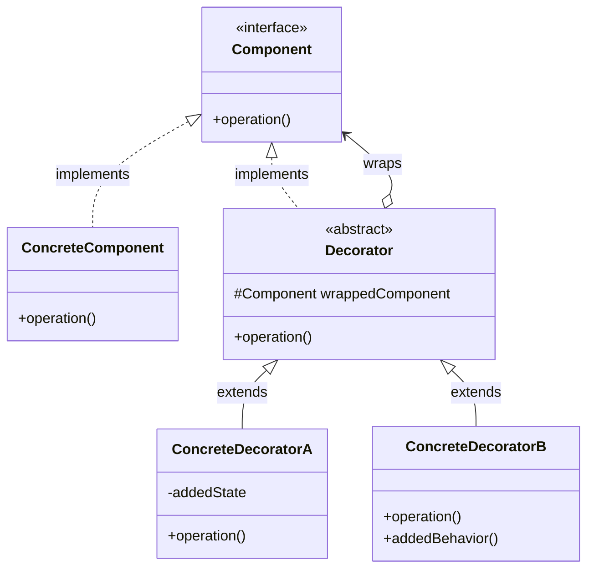
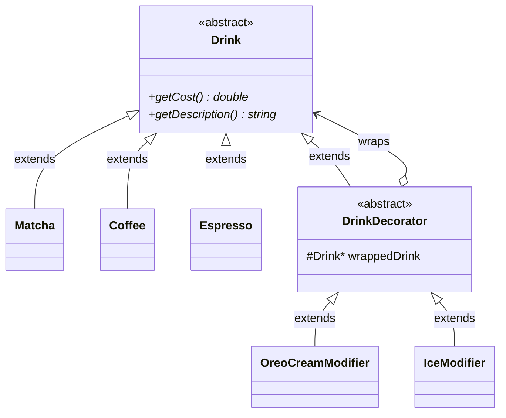

# Decorator Pattern

## The Problem

You're building a **cafe ordering system** for a Matcha shop. Customers can order a base Matcha and add any combination of ice modifier, oat milk, and extra shot.

You want to represent each individual drink as an object, where you can ask for its cost and description. You also want the system to be scalable, that is you can add  more modifiers (sugar modifier, paper cup, etc.).

### Naive solution 1

Include these options as members of the `Matcha` class:

```cpp
class Matcha {
    // implementation of Matcha
    // ...

    float iceModifier;
    bool oatMilk;
    bool extraShot;
};
```

This approach in fact does not violate the `HAS-A` relationship at all, but it raises a critical problem: If we have to add another modifier, we would have to modify the class `Matcha`, which is not a good practice for large-scale applications.

### Naive solution 2

We create derived class for each of the matcha drink with an associated topping:

```cpp
class MatchaWithIceModifier : Matcha {
    float iceModifier;
};
```

This way, there is no need to modify the original class `Matcha` and we can still treat the new matcha drink as a `Matcha` object via dynamic binding/polymorphism.

However, the problem is obvious:

```cpp
class MatchaWithIceModifier : Matcha;
class MatchaWithOatMilk : Matcha;
class MatchaWithExtraShot : Matcha;
```

Or even worse:

```cpp
class MatchaWithIce : public Matcha {};
class MatchaWithOatMilk : public Matcha {};
class MatchaWithExtraShot : public Matcha {};
class MatchaWithIceAndOatMilk : public Matcha {};
class MatchaWithIceAndExtraShot : public Matcha {};
class MatchaWithOatMilkAndExtraShot : public Matcha {};
class MatchaWithIceAndOatMilkAndExtraShot : public Matcha {};

// if we were to add a Boba modifier...
class MatchaWithBoba : public Matcha {};
class MatchaWithIceAndBoba : public Matcha {};
class MatchaWithOatMilkAndBoba : public Matcha {};
class MatchaWithExtraShotAndBoba : public Matcha {};
class MatchaWithIceAndOatMilkAndBoba : public Matcha {};
class MatchaWithIceAndExtraShotAndBoba : public Matcha {};
class MatchaWithOatMilkAndExtraShotAndBoba : public Matcha {};
class MatchaWithIceAndOatMilkAndExtraShotAndBoba : public Matcha {};
```

### Sub-optimal solution

To solve the problem of both naive solutions, we can design an abstract class that generalizes modifiers:

```cpp
class Modifier {
    virtual void modifyCost (int &cost) const = 0;
    virtual void modifyDescription (std::string &s) const = 0;
};
```

Then a matcha would hold a `vector` of pointers of `Modifier`s as follows:

```cpp
class Matcha {
    // implementation of Matcha
    // ...

    std::vector<Modifier*> modifiers;

    // modifying cost after applying modifiers
    int getCost() const {
        int newCost = cost;
        for (Modifier* modifer : modifiers)
            modifier->modifyCost(newCost);
        return newCost;
    }

    // modifying description after applying modifiers
    std::string getDescription() const {
        std::string newDescription = description;
        for (Modifier* modifier : modifiers)
            modifier->modifyDescription(newDescription);
        return newDescription;
    }
};
```

*To my research, this approach is called a **Composite Decorator** pattern.*

This approach is in fact somewhat a **partially acceptable** approach for the aforementioned solution. However, as we scale the application, there is one big problem: The base class (`Matcha` in this case) takes control on the modification: Which is good if we want modifiers to only modify the drink in some certain way (in this case, cost and description only). However, if we want the modifiers to freely modify the base class without having to explicitly calling modifications from the base class, we will need another approach. This problem along rises a series of other problems as a corollary.

## Decorator pattern

The decorator pattern is a popular structural design pattern in OOP, it resolves every aforementioned problems:
- Ensuring the modifiers are separate from the `Matcha` base drink.
- Allow the modifiers to be active in modifying the base drink, instead of passively waiting for the base drink to call it.

### Core ideas

We want to design the base `Matcha` drink and its modifiers as a linked list, where each node represents a single modifier. The tail node of this linked list is the base `Matcha` drink and the head of this linked list is the final modified `Matcha` drink.

Please note that every intermediate state of the linked list is still a valid `Matcha` drink with dynamic binding.


### Simplified implementation

To implement this idea, we start off with the base drink:

```cpp
class Matcha {
    // implementation of Matcha
    // ...

    // simply return cost
    virtual double getCost() const;
    // simply return description
    virtual std::string getDescription() const;
};
```

Now, we need intermediate abstract class that generalizes all modifiers but is still a `Matcha` at its heart:

```cpp
class MatchaDecorator {
protected:
    Matcha* wrapped; // we often use shared_ptr here

public:
    // the constructor takes in the state of the matcha drink that it wraps
    MatchaDecorator (Matcha* ptr) : wrapped(ptr) {}
};
```

Then we can implement an arbitrary modifier as follows:

```cpp
class OreoCreamModifier : public MatchaDecorator {
public:
    // use constructors of base class
    using MatchaDecorator::MatchaDecorator;

    // modify wrapped->getCost() and return new cost
    double getCost() const override;

    // modify wrapped->getDescription() and return new description
    std::string getDescription() const override;
};
```

## Architecture

### Class diagram

The general class diagram for a Decorator pattern is as follows:



### Full implementation for opening problem

Usually, we won't implement a decorator on top of a concrete class (e.g. `Matcha`). Instead, we usually implement it on top of an abstract class (i.e. a general abstract `Drink` class), that way, the decorator base class is also an abstract class and the application is more scalable in general.

We introduce the following base class:

```cpp
// abstract class
class Drink {
    // implementation of Drink
    // ...

    virtual double getCost() const = 0;
    virtual std::string getDescription() const = 0;
};
```

Then, we may implement concrete drinks on top of this class and override all purely virtual functions:

```cpp
// concrete classes
class Matcha : public Drink;
class Coffee : public Drink;
class Espresso : public Drink;
```

After, the decorator is built on top of `Drink` abstract class, not the concrete class, and then implement modifiers on top of this `DrinkDecorator`.

```cpp
// same as MatchaDecorator
class DrinkDecorator : public Drink;

// same as OreoCreamModifier in the simplified implementation
class OreoCreamModifier : public DrinkDecorator;
```

### Class diagram for the opening problem



### Usage

To use this pattern, we can do the following:

```cpp
Drink* baseMatcha = new Matcha();
Drink* oreoMatcha = new OreoCreamModifier(baseMatcha);
Drink* oreoMatchaWithMoreIce = new IceModifier(oreoMatcha);
```

## Discussion: Pros & Cons

As we have disscussed, the Decorator pattern opposes the following pros:

- Add/remove behaviour at runtime.
- Easy-to-scale in terms of adding more base drinks or modifiers, while following the open/close principle in development.
- Decorators can be combined freely.
- Decorators actively modify the base class.

Of course, every method has its own weaknesses and those of the Decorator pattern are:

- **Debugging:** Linked list are hard to debug without a `LinkedList` class wrapper, and the Decorator pattern is exactly linked lists without a wrapper at its heart.
- **Removal:** We can only remove decorators in a linked list manner, but it is highly inefficient and awkward compared to a linked-list. However, a Composite Decorator would naturally support removal.
- **Compability of decorators:** Let's say we want to implement a decorator that doesn't work for specific concrent classes (e.g. `OreoCreamModifier` won't work in `Beer` or `Wine`). In such cases, we have to do explicit type checking and throw a runtime error manually.

## Real-world applications

- **Java I/O streams**: `new BufferedReader(new FileReader(file))`
- **React Higher-Order Components** / Vue directives wrapping components with extra behavior
- **Express/Koa middleware** chains wrapping a request handler
- **UI theming**: wrapping a base component with `Bordered`, `Scrollable`, `WithTooltip`, etc.

## Quiz

### Multiple-choice quizzes

- Among the 3 main categories of OOP, which one best describes the Decorator pattern?
  - Creational.
  - **Structural.**
  - Behavioral.
- When is a Composite Decorator pattern preferred over a traditional Decorator pattern?
  - When we want ensure certain decorators cannot be placed on top of certain concrete classes.
  - **When decorators are designed to passively wait to be called by the object it is wrapping, for other benefits (e.g. efficient removal).**
  - When we want the decorators to actively modify the objects they are wrapping instead of passively waiting for them to be called.
- In a coffee shop system, which class should be the direct base class for the inheritance of `DrinkDecorator` class:
  - **`Drink`**.
  - `Matcha`.
  - `OreoCreamModifier`.
  - It is a base class on its own.
- In the Decorator pattern, which of the following choices describe a true `HAS-A` relationship:
  - The concrete component and the abstract component.
  - The concrete decorator and the abstract decorator.
  - The abstract decorator and the concrete component.
  - **The abstract decorator and the reference of the abstract component.**

### Open discussion questions

- In the Composite Decorator pattern, we use a `vector` of decorators, while in the Decorator pattern, decorators are technically arranged as linked lists. Can we say that using Composite Decorator pattern more cache-friendly? *No, because dynamic binding is not cache-friendly at the first place. If we were to do `std::vector<Decorator>`, it would be cache-friendly by the whole system failed at the first place.*