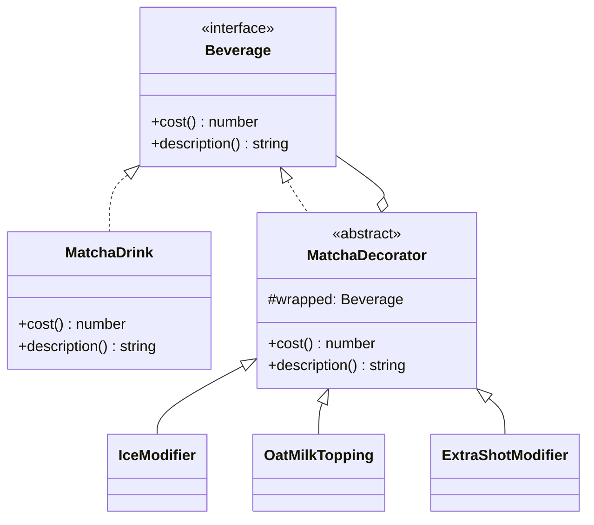
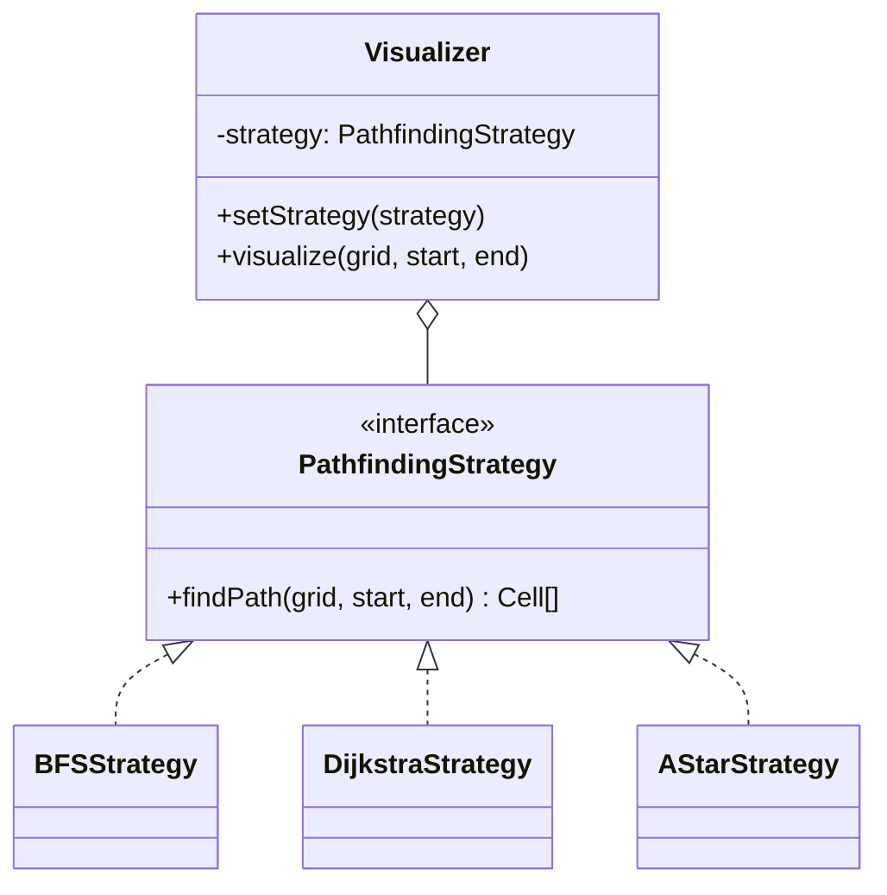
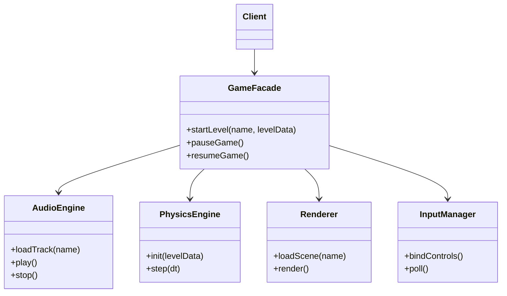

# Design Patterns Seminar Draft: Decorator, Strategy & Facade

---

## 1. Decorator Pattern

### The Problem
You're building a **cafe ordering system** for a Matcha shop. Customers can order a base Matcha and add any combination of `Ice`, `Oat Milk`, and `Extra Shot`. Without a pattern, you'd either:
- Create a subclass for every combination (`MatchaWithIceAndOatMilk`, `MatchaWithOatMilkAndExtraShot`, ...) — this explodes combinatorially (2ⁿ classes for n options), or
- Cram a bunch of boolean flags into one `Matcha` class and branch on them in `cost()`/`description()` — this violates the Open/Closed Principle: every new topping means editing tested code.

The **Decorator Pattern** lets you wrap a base object with modifier objects, stacking behavior at runtime without touching the original class or creating a class per combination.

### Class Diagram


### Quick Implementation
```cpp
#include <memory>
#include <string>
#include <iostream>

class Beverage {
public:
    virtual double cost() const = 0;
    virtual std::string description() const = 0;
    virtual ~Beverage() = default;
};

class MatchaDrink : public Beverage {
public:
    double cost() const override { return 4.5; }
    std::string description() const override { return "Matcha"; }
};

class MatchaDecorator : public Beverage {
protected:
    std::shared_ptr<Beverage> wrapped;
public:
    explicit MatchaDecorator(std::shared_ptr<Beverage> b) : wrapped(std::move(b)) {}
};

class IceModifier : public MatchaDecorator {
public:
    using MatchaDecorator::MatchaDecorator;
    double cost() const override { return wrapped->cost(); } // free, just changes texture
    std::string description() const override { return wrapped->description() + " + Ice"; }
};

class OatMilkTopping : public MatchaDecorator {
public:
    using MatchaDecorator::MatchaDecorator;
    double cost() const override { return wrapped->cost() + 0.7; }
    std::string description() const override { return wrapped->description() + " + Oat Milk"; }
};

class ExtraShotModifier : public MatchaDecorator {
public:
    using MatchaDecorator::MatchaDecorator;
    double cost() const override { return wrapped->cost() + 1.0; }
    std::string description() const override { return wrapped->description() + " + Extra Shot"; }
};

// Usage
int main() {
    std::shared_ptr<Beverage> order = std::make_shared<MatchaDrink>();
    order = std::make_shared<IceModifier>(order);
    order = std::make_shared<OatMilkTopping>(order);

    std::cout << order->description() << "\n"; // "Matcha + Ice + Oat Milk"
    std::cout << order->cost() << "\n";         // 5.2
}
```

### Pros & Cons
| Pros | Cons |
|---|---|
| Add/remove behavior at runtime, no subclass explosion | Many small classes to keep track of |
| Follows Open/Closed Principle — new toppings don't touch old code | Order of wrapping can matter and confuse debugging |
| Decorators can be combined freely | A long decorator chain can be harder to read/trace |

### Broader Applications
- **Java I/O streams**: `new BufferedReader(new FileReader(file))`
- **React Higher-Order Components** / Vue directives wrapping components with extra behavior
- **Express/Koa middleware** chains wrapping a request handler
- **UI theming**: wrapping a base component with `Bordered`, `Scrollable`, `WithTooltip`, etc.

---

## 2. Strategy Pattern

### The Problem
You're building a **pathfinding visualizer** for a data structures course — users draw a grid and pick an algorithm (BFS, Dijkstra, A*) to find the shortest path. A naive `Visualizer` class with one `findPath(type: string)` method and a giant `switch` statement means:
- Adding a new algorithm requires editing an already-tested class (violates Open/Closed),
- Algorithms can't be unit-tested in isolation from the visualizer,
- Swapping algorithms mid-session gets messy since state and logic are tangled together.

The **Strategy Pattern** extracts each algorithm into its own interchangeable class, so the visualizer just holds a reference to "whatever algorithm is currently selected."

### Class Diagram


### Quick Implementation
```cpp
#include <vector>
#include <memory>

struct Cell { int x, y; };
struct Grid { /* grid data */ };

class PathfindingStrategy {
public:
    virtual std::vector<Cell> findPath(const Grid& grid, Cell start, Cell end) = 0;
    virtual ~PathfindingStrategy() = default;
};

class BFSStrategy : public PathfindingStrategy {
public:
    std::vector<Cell> findPath(const Grid& grid, Cell start, Cell end) override {
        // breadth-first search logic
        return {};
    }
};

class DijkstraStrategy : public PathfindingStrategy {
public:
    std::vector<Cell> findPath(const Grid& grid, Cell start, Cell end) override {
        // Dijkstra logic
        return {};
    }
};

class Visualizer {
    std::shared_ptr<PathfindingStrategy> strategy;
public:
    explicit Visualizer(std::shared_ptr<PathfindingStrategy> s) : strategy(std::move(s)) {}

    void setStrategy(std::shared_ptr<PathfindingStrategy> s) { strategy = std::move(s); }

    void visualize(const Grid& grid, Cell start, Cell end) {
        auto path = strategy->findPath(grid, start, end);
        // render `path` step by step on the grid
    }
};

// Usage
int main() {
    Grid grid;
    Cell start{0, 0}, end{5, 5};

    Visualizer viz(std::make_shared<BFSStrategy>());
    viz.visualize(grid, start, end);

    viz.setStrategy(std::make_shared<DijkstraStrategy>()); // swap algorithm at runtime
    viz.visualize(grid, start, end);
}
```

### Pros & Cons
| Pros | Cons |
|---|---|
| Swap algorithms at runtime without touching the context class | Client must know which strategies exist to pick correctly |
| Each algorithm testable and maintainable in isolation | More classes/objects than a single monolithic method |
| Follows Open/Closed — new algorithm = new class, no edits | Some overhead passing data between context and strategy |

### Broader Applications
- **Sorting/comparators**: Java `Comparator`, Python `key=` functions
- **Payment processing**: `CreditCardStrategy`, `PayPalStrategy`, `CryptoStrategy`
- **Compression tools** choosing between `ZipStrategy`, `GzipStrategy`
- **Game AI**: swapping `PatrolBehavior`, `ChaseBehavior`, `FleeBehavior` based on game state

---

## 3. Facade Pattern

### The Problem
You're building a **2D game engine** and starting a level requires coordinating `Renderer`, `PhysicsEngine`, `AudioEngine`, and `InputManager` — each with its own setup order and quirks. Without a pattern, every place that starts a level (main menu, level select, restart-after-death) needs to know this exact sequence:

```
renderer.loadScene(...) → physics.init(...) → audio.loadTrack(...) → audio.play() → input.bindControls()
```

Any change to a subsystem's API means hunting down every call site. This tight coupling between client code and multiple subsystems is exactly what the **Facade Pattern** hides behind one simple entry point.

### Class Diagram


### Quick Implementation
```cpp
#include <string>

struct LevelData { /* level data */ };

class AudioEngine {
public:
    void loadTrack(const std::string& name) { /* ... */ }
    void play() { /* ... */ }
};

class PhysicsEngine {
public:
    void init(const LevelData& levelData) { /* ... */ }
};

class Renderer {
public:
    void loadScene(const std::string& name) { /* ... */ }
};

class InputManager {
public:
    void bindControls() { /* ... */ }
};

class GameFacade {
    AudioEngine audio;
    PhysicsEngine physics;
    Renderer renderer;
    InputManager input;

public:
    void startLevel(const std::string& name, const LevelData& levelData) {
        renderer.loadScene(name);
        physics.init(levelData);
        audio.loadTrack(name + "-theme");
        audio.play();
        input.bindControls();
    }
};

// Usage — client only ever talks to the facade
int main() {
    GameFacade game;
    LevelData levelData;
    game.startLevel("Level1", levelData);
}
```

### Pros & Cons
| Pros | Cons |
|---|---|
| Simplifies client code — one call instead of many | Facade can turn into a "god object" if it keeps absorbing logic |
| Decouples client from subsystem internals | May hide useful subsystem features unless explicitly exposed |
| Easier to swap out a subsystem's implementation later | Adds an extra layer of indirection |

### Broader Applications
- **jQuery**: a facade over verbose raw DOM APIs
- **ORMs** (e.g., Sequelize, SQLAlchemy): facade over raw SQL
- **Cloud SDKs**: one client object hiding dozens of underlying REST calls
- Classic GoF example: a `HomeTheaterFacade` wrapping the DVD player, projector, amplifier, and lights

---

## Quick Comparison

| Pattern | Core Idea | Structural Type | Solves |
|---|---|---|---|
| **Decorator** | Wrap an object to add responsibilities | Structural | Combinatorial subclass explosion |
| **Strategy** | Encapsulate interchangeable algorithms | Behavioral | Rigid conditional logic for algorithm choice |
| **Facade** | Provide one simple interface to a complex subsystem | Structural | Tight coupling to many subsystem APIs |
