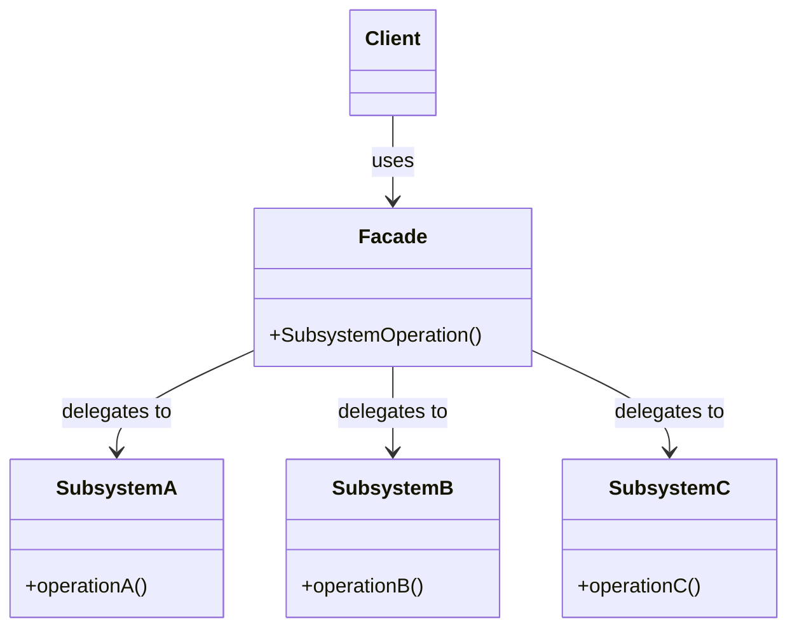
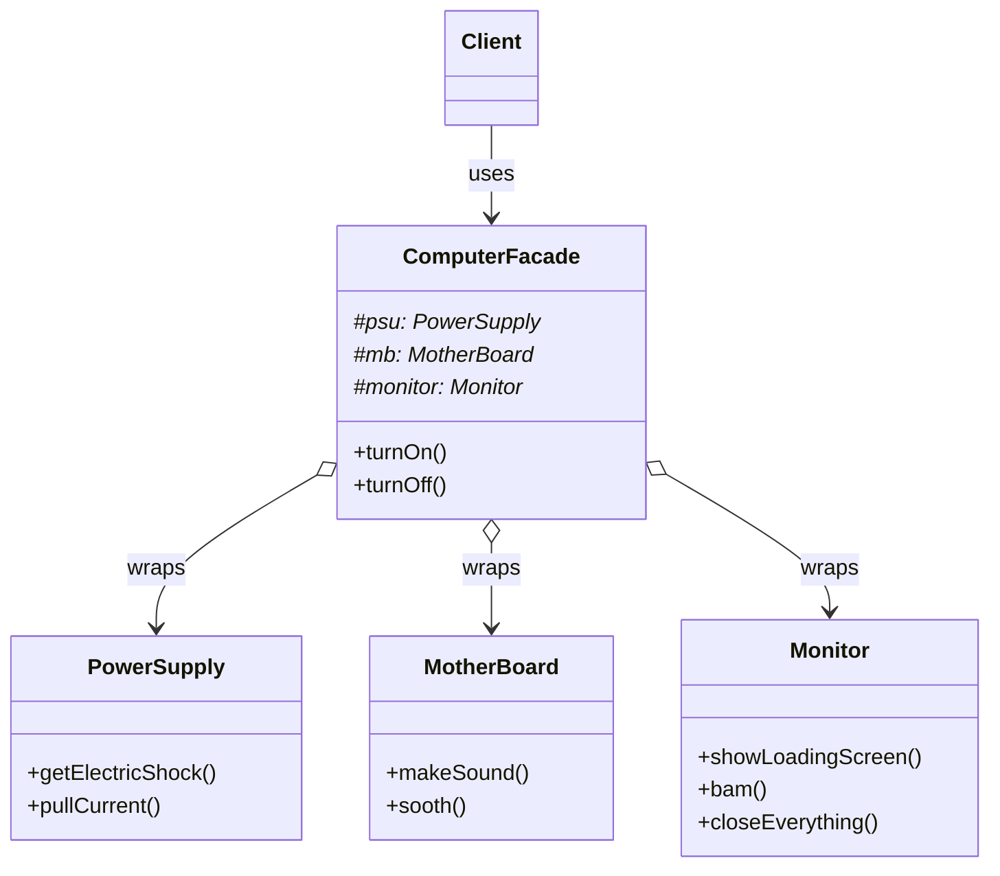

# Facade Pattern

## The Problem

How do you turn on the computer? You just "Hit the power button!". That is what you believe because you are using a simple interface that the computer provides on the outside, but internally it has to do a lot of stuff to make it happen.

If we look at a computer subsystem, it actually consists of many complex internal components. Without a simple interface like a power button, every time a user wants to use the computer, they would have to manually jump-start the power supply, manually trigger the motherboard's boot sequence, and manually initialize the monitor. 

This requires the client to know the exact internal methods and the precise execution order just to perform a basic action. We want to represent this startup sequence easily (with a single button), while ensuring the underlying system remains scalable and decoupled.

### Naive solution 1

The client interacts directly with the complex subsystems and manually calls every required method in the exact correct order:

```cpp
#include <iostream>

class PowerSupply {
public:
    void getElectricShock() { std::cout << "Ouch!\n"; }
    void pullCurrent() { std::cout << "Haaah!\n"; }
};

class MotherBoard {
public:
    void makeSound() { std::cout << "Beep beep!\n"; }
    void sooth() { std::cout << "Zzzzz\n"; }
};

class Monitor {
public:
    void showLoadingScreen() { std::cout << "Loading..\n"; }
    void bam() { std::cout << "Ready to be used!\n"; }
    void closeEverything() { std::cout << "Bup bup bup buzzzz!\n"; }
};
```

If the user wants to turn on the computer, the client code must do this:

```cpp
int main() {
    PowerSupply psu;
    MotherBoard mb;
    Monitor monitor;

    // The client has to manually coordinate and call everything!
    psu.getElectricShock();
    mb.makeSound();
    monitor.showLoadingScreen();
    monitor.bam();
    
    return 0;
}
```

This raises a critical problem: Every single place in the application that needs to turn on the computer must duplicate this exact sequence. If the hardware startup sequence changes, we have to modify the client code everywhere, which is not a good practice for large-scale applications.

### Naive solution 2

To avoid duplicating the sequence in the client, we might make the subsystems aware of each other so they can trigger the next step automatically in a chain:

```cpp
class Monitor {
public:
    void showLoadingScreen() { 
        std::cout << "Loading..\n"; 
        bam();
    }
    void bam() { std::cout << "Ready to be used!\n"; }
};

class MotherBoard {
    Monitor* monitor;
public:
    void makeSound() { 
        std::cout << "Beep beep!\n"; 
        monitor->showLoadingScreen();
    }
};

class PowerSupply {
    MotherBoard* mb;
public:
    void getElectricShock() { 
        std::cout << "Ouch!\n"; 
        mb->makeSound();
    }
};
```

This way, the client just calls `psu.getElectricShock()`, and it chains the rest of the startup sequence. 

However, the problem is obvious: We have introduced **tight coupling** between all the subsystem classes. `PowerSupply` is now permanently bound to `MotherBoard`, meaning we can't test, reuse, or scale the `PowerSupply` code in isolation. 

### Sub-optimal solution

To solve the tight coupling between subsystems, we could create a monolithic `GodComputer` class that uses Multiple Inheritance to absorb all the subsystems into one object:

```cpp
class GodComputer : public PowerSupply, public MotherBoard, public Monitor {
public:
    void turnOn() {
        getElectricShock();
        makeSound();
        showLoadingScreen();
        bam();
    }
};
```

*This approach is often considered an anti-pattern in scalable applications.*

As we scale the application, there is one big problem: Multiple inheritance can lead to the "Diamond Problem" and messy namespace collisions. Furthermore, the `GodComputer` class exposes *all* the internal methods (like `getElectricShock()`) to the client, failing to hide the complexity. The client could easily bypass `turnOn()` and mess up the startup sequence by calling `makeSound()` directly.

## Facade pattern

The facade pattern is a popular structural design pattern in OOP, it resolves every aforementioned problem:
- Ensuring the complex subsystem classes remain decoupled from each other.
- Hiding the complicated internal methods from the client.
- Providing a single, simple method for the client to execute a complex sequence safely.

### Core ideas

We want to design a single wrapper class (the Facade) that provides a simple and unified interface to a complex set of interfaces in a subsystem. The facade doesn't encapsulate the subsystem entirely (advanced clients can still bypass it if they really need to), but it delegates the most common client requests to the appropriate objects within the subsystem.

### Simplified implementation

To implement this idea, we start off by restoring our clean, decoupled subsystem classes:

```cpp
class PowerSupply {
public:
    void getElectricShock() { std::cout << "Ouch!\n"; }
    void pullCurrent() { std::cout << "Haaah!\n"; }
};

class MotherBoard {
public:
    void makeSound() { std::cout << "Beep beep!\n"; }
    void sooth() { std::cout << "Zzzzz\n"; }
};

class Monitor {
public:
    void showLoadingScreen() { std::cout << "Loading..\n"; }
    void bam() { std::cout << "Ready to be used!\n"; }
    void closeEverything() { std::cout << "Bup bup bup buzzzz!\n"; }
};
```

Now, we introduce the `ComputerFacade` which aggregates these subsystems:

```cpp
class ComputerFacade {
protected:
    PowerSupply psu;
    MotherBoard mb;
    Monitor monitor;

public:
    // The facade exposes a clean, simple interface
    void turnOn() {
        psu.getElectricShock();
        mb.makeSound();
        monitor.showLoadingScreen();
        monitor.bam();
    }

    void turnOff() {
        monitor.closeEverything();
        psu.pullCurrent();
        mb.sooth();
    }
};
```

## Architecture

### Class diagram

The general class diagram for a Facade pattern is as follows:



### Full implementation for opening problem

Usually, the Facade will take pointers or references to the subsystems in its constructor (Dependency Injection) rather than instantiating them itself. That way, the application is more flexible, modular, and testable.

We introduce the facade that takes in the subsystems:

```cpp
#include <memory>
#include <iostream>

class ComputerFacade {
protected:
    std::shared_ptr<PowerSupply> psu;
    std::shared_ptr<MotherBoard> mb;
    std::shared_ptr<Monitor> monitor;

public:
    ComputerFacade(std::shared_ptr<PowerSupply> p, 
                   std::shared_ptr<MotherBoard> m, 
                   std::shared_ptr<Monitor> mon) 
        : psu(p), mb(m), monitor(mon) {}

    void turnOn() {
        psu->getElectricShock();
        mb->makeSound();
        monitor->showLoadingScreen();
        monitor->bam();
    }

    void turnOff() {
        monitor->closeEverything();
        psu->pullCurrent();
        mb->sooth();
    }
};

// Usage — client only ever talks to the facade
int main() {
    auto psu = std::make_shared<PowerSupply>();
    auto mb = std::make_shared<MotherBoard>();
    auto monitor = std::make_shared<Monitor>();

    ComputerFacade computer(psu, mb, monitor);
    
    computer.turnOn(); 
    // Output: Ouch! Beep beep! Loading.. Ready to be used!

    computer.turnOff(); 
    // Output: Bup bup bup buzzzz! Haaah! Zzzzz
    
    return 0;
}
```

### Class diagram for the opening problem




## Discussion: Pros & Cons

As we have discussed, the Facade pattern opposes the following pros:

- Simplifies client code — one method call instead of many.
- Decouples client code from subsystem internals, reducing dependencies (Law of Demeter).
- Makes it easier to swap out a subsystem's implementation later without breaking client code.
- Shields clients from the complexities of the subsystem components.

Of course, every method has its own weaknesses and those of the Facade pattern are:

- **God Object Risk:** The Facade can turn into a "god object" if it keeps absorbing all logic and connecting to every class in an application.
- **Hidden Features:** May hide useful or advanced subsystem features unless they are explicitly exposed.
- **Indirection:** Adds an extra layer of indirection which might be unnecessary for very simple applications.

## Real-world applications

### Web Development
- **jQuery**: Acts as a massive facade over verbose and historically inconsistent raw browser DOM APIs. Instead of dealing with `document.getElementById` and cross-browser event listener quirks, developers just use `$('#id').on('click', ...)`.
- **Axios / Fetch API wrappers**: Many frontend codebases create an `api.js` facade that hides the complexity of setting up headers, interceptors, authentication tokens, and error handling for HTTP requests.
- **Backend ORMs** (e.g., Sequelize, Prisma, SQLAlchemy): A facade over raw SQL queries and database connections. You call `User.find()`, and the ORM handles connection pooling, SQL injection prevention, and dialect translation.

### Mobile Development
- **Camera/Hardware APIs**: Mobile OSs (iOS/Android) have extremely complex hardware APIs (AVFoundation on iOS, CameraX on Android). React Native or Flutter libraries provide a unified `Camera` facade so developers don't have to write hundreds of lines of native device-management code.
- **Local Storage**: Libraries like `AsyncStorage` or `SharedPreferences` wrappers act as facades over complex native SQL/SQLite databases or file I/O operations.

### Game Development
- **Game Engine Subsystems**: As seen in our example, game engines (like Unity or Unreal) often provide high-level facade classes (`SceneManager`, `Time`, `Physics`) that hide the complex, low-level memory allocation, thread management, and math operations happening behind the scenes.
- **Audio Managers**: Instead of manually loading sound buffers into memory, assigning them to audio channels, and calculating spatial audio falloff, developers interact with a facade like `AudioManager.Play("explosion", volume, position)`.

## Quiz

### Multiple-choice quizzes

- Among the 3 main categories of OOP, which one best describes the Facade pattern?
  - Creational.
  - **Structural.**
  - Behavioral.
- When is a Facade pattern most useful?
  - When we want to add behaviors to an object dynamically at runtime.
  - **When we want to provide a simple interface to a complex subsystem.**
  - When we want to encapsulate interchangeable algorithms.
- In the computer example system, which class acts as the Facade?
  - `PowerSupply`.
  - `Client`.
  - **`ComputerFacade`**.
- In the Facade pattern, which of the following choices describe a true `HAS-A` relationship:
  - The client and the subsystem classes.
  - **The facade and the subsystem classes.**
  - The facade and the client.
  - The individual subsystem classes with each other.

### Open discussion questions

- If a subsystem becomes too complex and the Facade itself grows into a "God object", how could you refactor it to maintain a clean architecture? *Instead of having one giant Facade for everything, you can introduce additional Facades. You can split it into multiple, smaller Facades (e.g., an `AudioFacade` and a `PhysicsFacade`), where each handles a specific logical grouping within the larger subsystem. Furthermore, Facades can use other Facades to orchestrate even higher-level operations without becoming bloated.*
