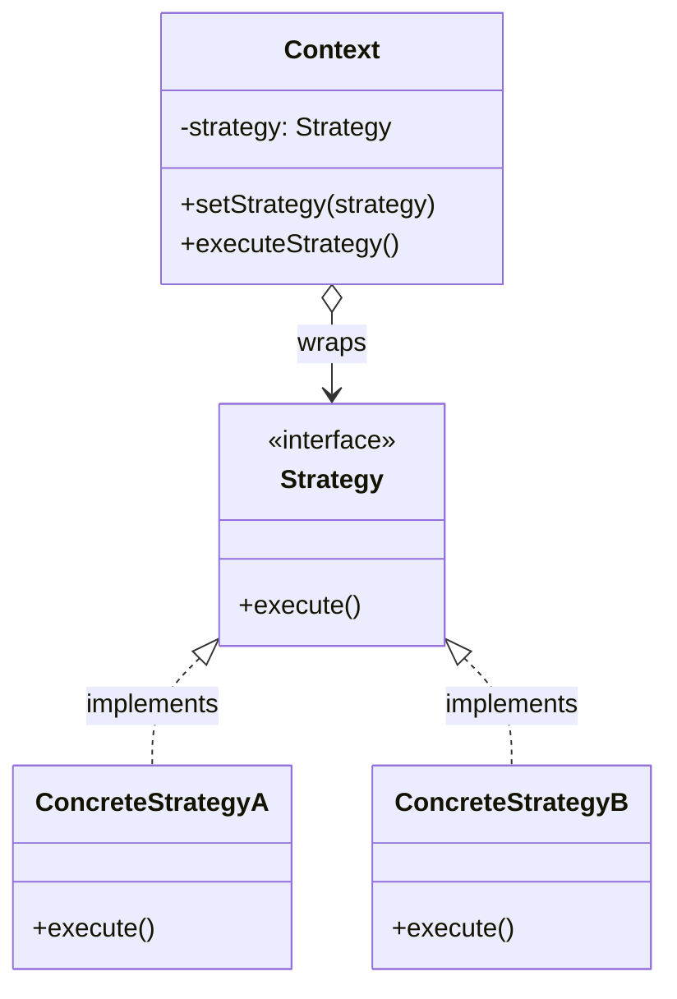
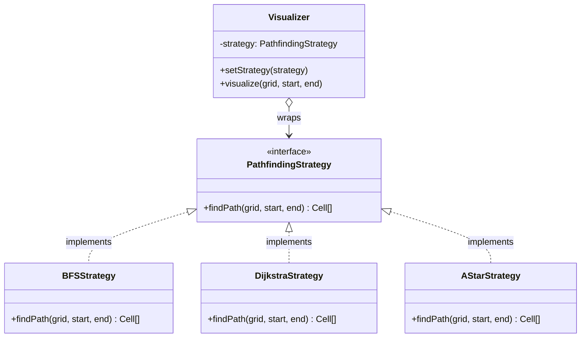

# Strategy Pattern

## The Problem

You're building a **pathfinding visualizer** for a data structures course — users draw a grid and pick an algorithm (BFS, Dijkstra, A*) to find the shortest path. 

You want to represent a visualizer that takes in a grid and visualizes the path finding process.

### Naive solution

A naive `Visualizer` class with one `findPath(type: string)` method and a giant `switch` statement:

```cpp
class Visualizer {
    // ...
    void visualize(const Grid& grid, Cell start, Cell end, std::string type) {
        if (type == "BFS") {
            // BFS logic
        } else if (type == "Dijkstra") {
            // Dijkstra logic
        } else if (type == "AStar") {
            // A* logic
        }
    }
};
```

This approach has some critical problems:
- Adding a new algorithm requires editing an already-tested class (violates Open/Closed principle).
- Algorithms can't be unit-tested in isolation from the visualizer.
- Swapping algorithms mid-session gets messy since state and logic are tangled together.

## Strategy pattern

The **Strategy Pattern** is a behavioral design pattern that extracts each algorithm into its own interchangeable class, so the context class (visualizer) just holds a reference to "whatever algorithm is currently selected."

### Core ideas

We define a family of algorithms, put each of them into a separate class, and make their objects interchangeable. 
The original object, called context, holds a reference to a strategy object. The context delegates the work to a linked strategy object instead of executing it on its own.
The context isn't responsible for selecting an appropriate algorithm. Instead, the client passes the desired strategy to the context.

### Simplified implementation

We start by defining a common interface for all pathfinding strategies:

```cpp
class PathfindingStrategy {
public:
    virtual std::vector<Cell> findPath(const Grid& grid, Cell start, Cell end) = 0;
    virtual ~PathfindingStrategy() = default;
};
```

Then we can implement concrete strategies:

```cpp
class BFSStrategy : public PathfindingStrategy {
public:
    std::vector<Cell> findPath(const Grid& grid, Cell start, Cell end) override {
        // breadth-first search logic
        return {};
    }
};

class DijkstraStrategy : public PathfindingStrategy {
public:
    std::vector<Cell> findPath(const Grid& grid, Cell start, Cell end) override {
        // Dijkstra logic
        return {};
    }
};
```

## Architecture

### Class diagram

The general class diagram for a Strategy pattern is as follows:



### Full implementation for opening problem

We integrate the strategies with the `Visualizer` (the Context):

```cpp
class Visualizer {
    std::shared_ptr<PathfindingStrategy> strategy;
public:
    explicit Visualizer(std::shared_ptr<PathfindingStrategy> s) : strategy(std::move(s)) {}

    void setStrategy(std::shared_ptr<PathfindingStrategy> s) { 
        strategy = std::move(s); 
    }

    void visualize(const Grid& grid, Cell start, Cell end) {
        // delegates the pathfinding work to the strategy
        auto path = strategy->findPath(grid, start, end);
        // render `path` step by step on the grid
    }
};
```

### Class diagram for the opening problem



### Usage

To use this pattern, we can do the following:

```cpp
int main() {
    Grid grid;
    Cell start{0, 0}, end{5, 5};

    Visualizer viz(std::make_shared<BFSStrategy>());
    viz.visualize(grid, start, end);

    // swap algorithm at runtime easily
    viz.setStrategy(std::make_shared<DijkstraStrategy>()); 
    viz.visualize(grid, start, end);
}
```

## Discussion: Pros & Cons

The Strategy pattern opposes the following pros:

- Swap algorithms at runtime without touching the context class.
- Each algorithm is testable and maintainable in isolation.
- Follows Open/Closed Principle — adding a new algorithm means creating a new class, with no edits to existing code.
- Replaces massive conditionals or switch statements.

Weaknesses of the Strategy pattern:

- **Client Knowledge:** The client must know the differences between strategies to be able to pick a proper one.
- **Overhead:** Introduces more classes/objects than a single monolithic method.
- **Data Passing:** Some overhead passing data between context and strategy (e.g. passing parameters that might not be used by all strategies).

## Real-world applications

- **Sorting/comparators**: Java `Comparator`, Python `key=` functions
- **Payment processing**: `CreditCardStrategy`, `PayPalStrategy`, `CryptoStrategy`
- **Compression tools** choosing between `ZipStrategy`, `GzipStrategy`
- **Game AI**: swapping `PatrolBehavior`, `ChaseBehavior`, `FleeBehavior` based on game state

## Quiz

### Multiple-choice quizzes

- Among the 3 main categories of OOP, which one best describes the Strategy pattern?
  - Creational.
  - Structural.
  - **Behavioral.**
- What principle is most directly satisfied when using the Strategy Pattern to replace a large switch statement of algorithms?
  - Liskov Substitution Principle.
  - **Open/Closed Principle.**
  - Dependency Inversion Principle.
- Who is generally responsible for choosing the specific Strategy to be used?
  - The Context.
  - The Strategy interface.
  - **The Client.**
- In the Strategy pattern, which of the following choices describe a true `HAS-A` relationship:
  - The Concrete Strategy and the Strategy interface.
  - **The Context and the Strategy interface.**
  - The Context and the Concrete Strategy.
  - The Client and the Strategy interface.

### Open discussion questions

- If some of the Strategies don't need all the data passed from the Context via the strategy method arguments, how could we address this to avoid useless data passing? *Instead of passing specific data from the context as parameters, we can pass a reference/pointer of the context itself to the strategy method, or let the strategy maintain a reference to the context when it is created. That way, the strategy can query exactly what data it needs from the context.*
